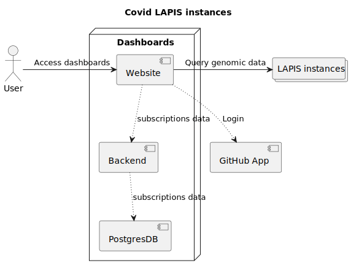

# System Context

* Users access the dashboards website via HTTP.
* The backend is not publicly accessible since it does not have authorization implemented.
  All access should be proxied through the website.
* To log in, we use a GitHub OAuth app.
  Users can log in with their GitHub account to access additional account related features.
  * Note that the subscription feature is currently on hold and not fully implemented yet.
  * No login is required to access the visualization pages.
