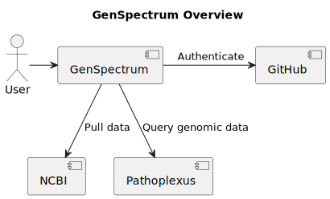
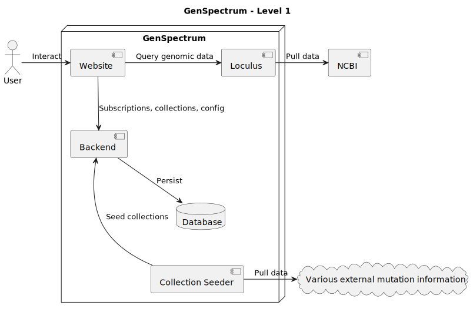

# Building Block View

## Level 0: System Context

This diagram shows GenSpectrum in the context of its neighboring systems.

* Users interact with GenSpectrum via the website.
* Genomic sequence data is queried from Pathoplexus.
* Raw sequence data is pulled from NCBI.
* GitHub is used for user authentication via OAuth.

## Level 1: GenSpectrum Internals

This diagram shows the main components inside GenSpectrum.

* The **Website** is the user-facing frontend. It talks to the Backend for user accounts, subscriptions, collections and configuration. For genomic data it queries both the internal Loculus instance and Pathoplexus directly. Authentication is handled via **GitHub** OAuth.
* The **Backend** manages users, subscriptions, collections and configuration, persisting data to the **Database**.
* **Loculus** is the internal genomic data platform, pulling raw sequence data from **NCBI**.
* The **Collection Seeder** seeds collection metadata into the Backend, pulling from various external mutation information sources.
* **Pathoplexus** and **GitHub** are external systems, shown with dashed borders.
