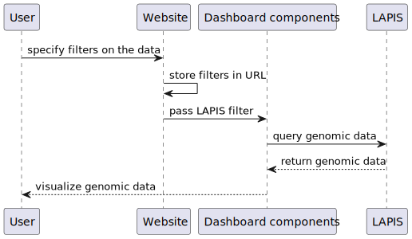
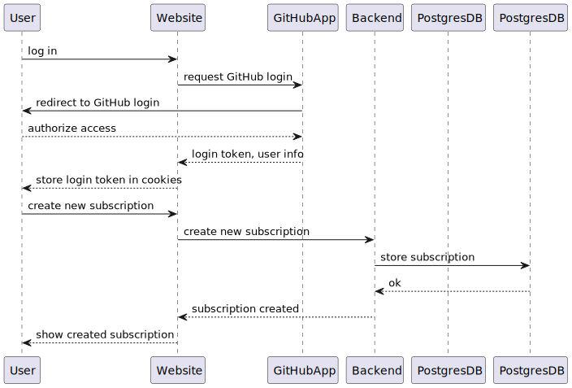

# Runtime View

This depicts an example use case of a user using the GenSpectrum dashboards to explore pathogen genomic data:

This diagram shows the login process that is required before adding a subscription:

